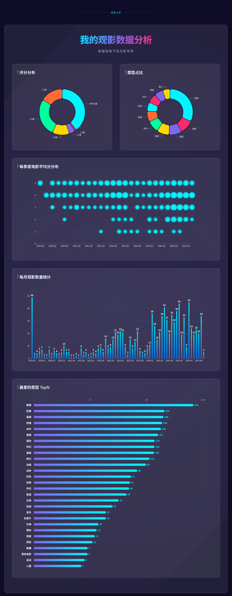
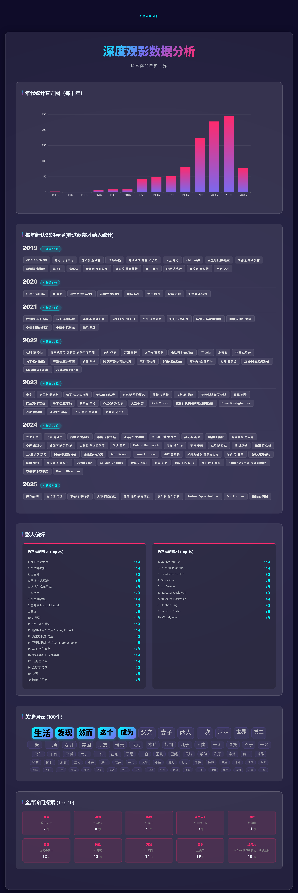
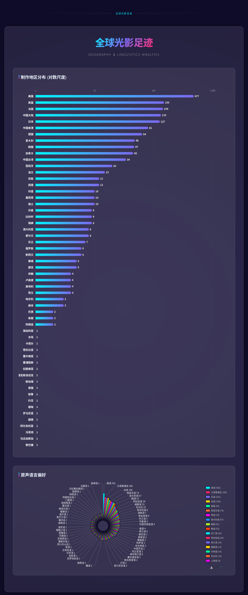
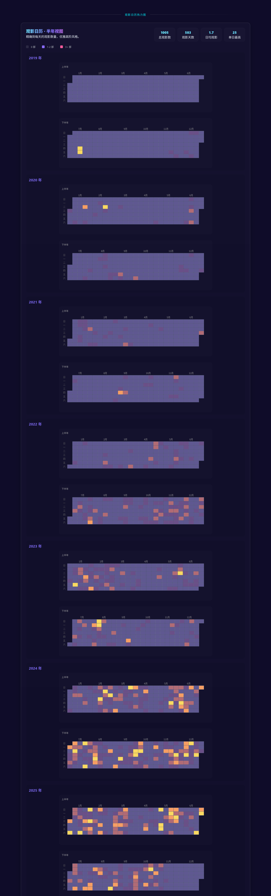
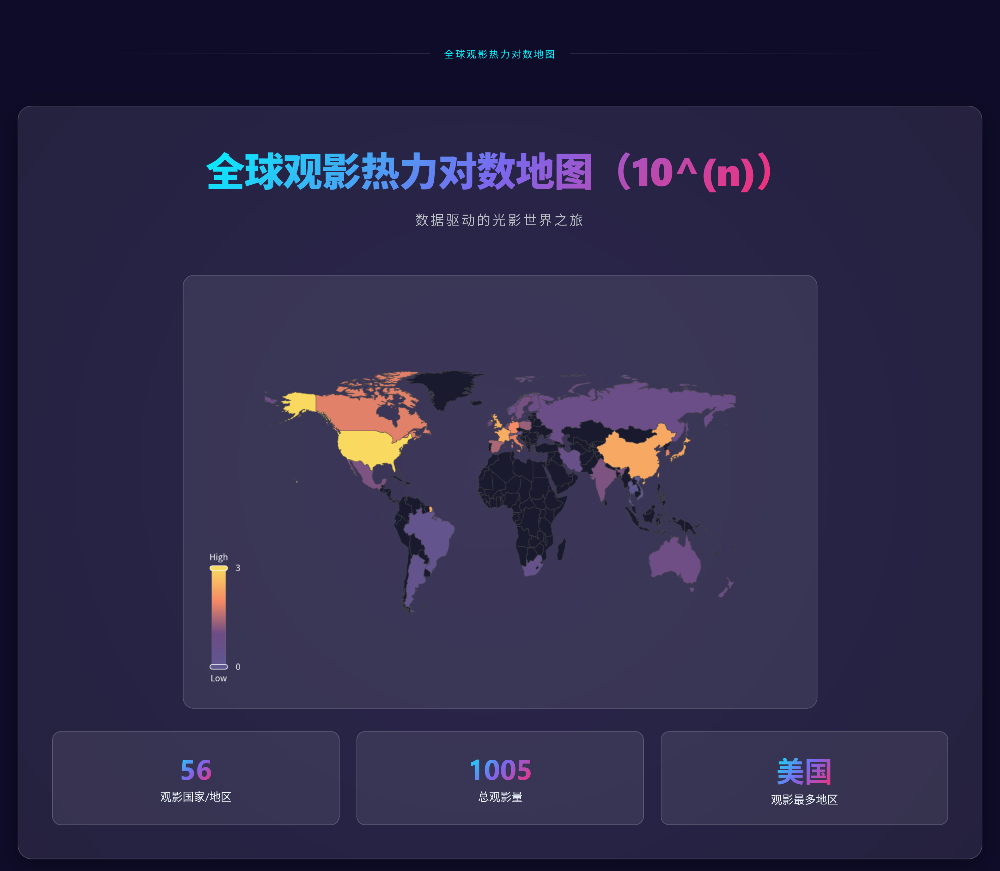
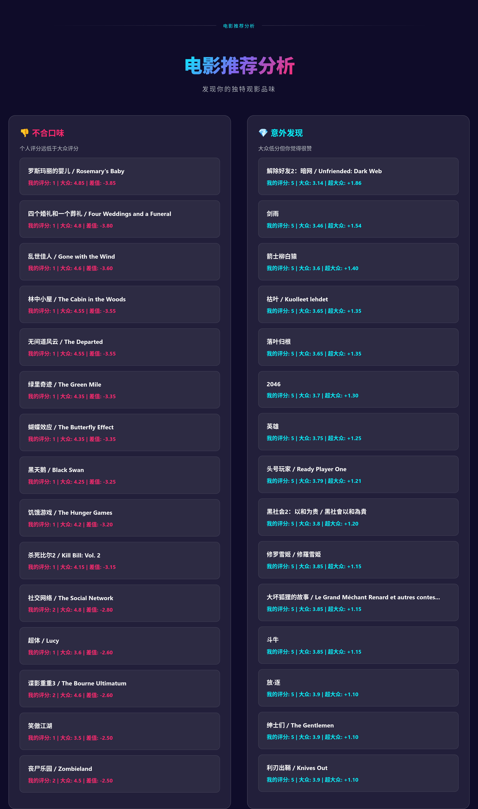
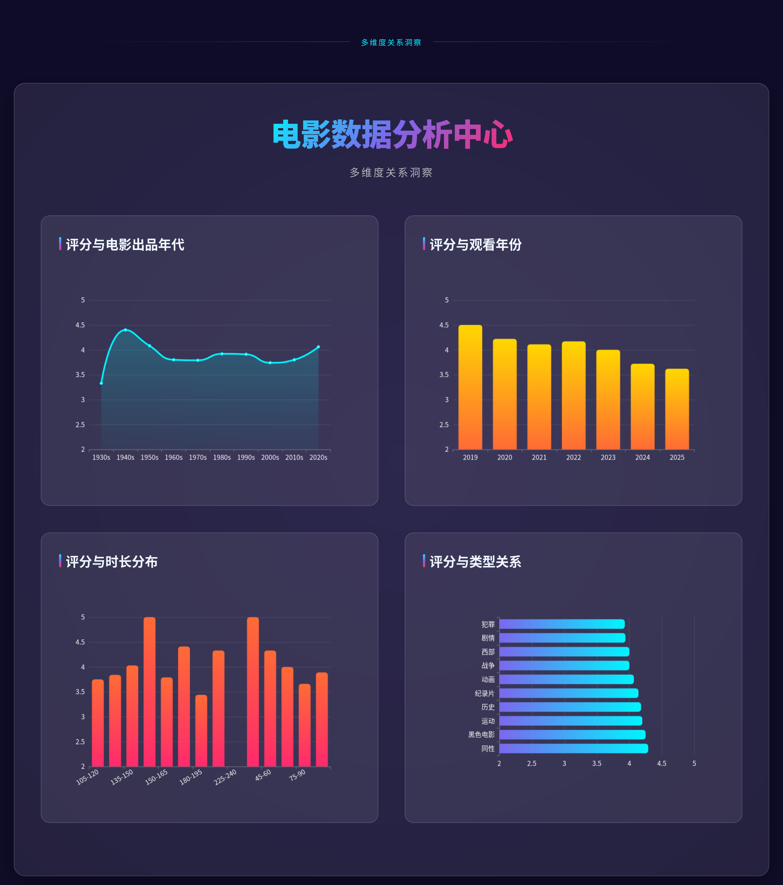

# Doubanv2

(Vibe Coding) Analyze and show personal or others' (open to the public) cinema records on the Douban platform with HTML, based on static databases. And use the TMDB API to download and show posters, also with local record search.

# DoubanV2 Movie Data Project

> **✨ Powered by Vibe Coding** > 这是一个基于 AI 辅助编程构建的电影数据聚合项目，支持多用户与本地静态数据库分析与展示。

---

## ⚠️ 免责声明 (Disclaimer)

> **Disclaimer:** This project is for educational purposes only. Data is sourced from IMDb, TMDB, and Rotten Tomatoes. The copyright of the data belongs to the respective owners. Please comply with their Terms of Service.
> 
> **声明：** 本项目仅供学习交流。数据来源于 豆瓣, IMDb, TMDB 和烂番茄，数据版权归原作者所有，请遵守相关服务条款。

---

## 效果展示


















---

## 🚀 项目特性

* **多用户支持**：支持配置多个用户，除了海报资源（为了节省网络开销）是共享的，其他用户数据彼此隔离。
* **统计与展示**：比官方统计报告更好。
* **本地静态数据库**：整合了 IMDb、Rotten Tomatoes 等多个数据源的静态数据，减少在线 API 请求。
* **词云过滤**：内置 `jiebastop.txt` 停用词库，支持自定义词云屏蔽词。
* **代理支持**：支持配置网络代理，方便下载 TMDB 海报资源。

---

## ⚡️ 快速开始 (Quick Start)

请按照以下顺序配置并运行项目：

**1. 部署静态数据库**
下载并将解压后的静态数据库文件（`.csv`, `.tsv` 等）放入项目的资源目录中：

* **目标路径**: `Doubanv2/resources/StaticMovieDB/`

**2. 安装依赖库**
在项目根目录下，运行以下命令安装所需的第三方库：

```bash
pip install -r requirements.txt
```

**3. 修改配置文件**
编辑 `Doubanv2/resources/config.json` 文件，填入你的豆瓣 ID、TMDB API Key 以及网络代理地址。

**4. 启动项目**
完成上述配置后，在Doubanv2/src/doubanv2/目录下运行启动脚本：

```bash
python Doubanv2/src/doubanv2/__init__.py
```

---

## 🛠️ 安装与使用 (Getting Started)

### 1. 环境准备

确保你的环境已安装 Python，并安装项目依赖：

```bash
pip install -r requirements.txt
```

### 2. 数据准备 (必做)

由于数据量较大且涉及版权，静态数据库文件托管在外部网盘。

1. **下载数据文件**：[Google Drive 下载链接](https://drive.google.com/file/d/1pjAVEtx5BmsJF96E4TtA3A-mKsJ6UTau/view?usp=sharing)[百度云 下载链接](https://pan.baidu.com/s/1ZfABAmrV23DHKIN_CcVGlg?pwd=lvmv)
2. **解压与放置**：请将下载的文件解压并替换到以下目录：
   `Doubanv2/resources/StaticMovieDB`

**目录结构应如下所示：**

```text
[Doubanv2/resources/StaticMovieDB]
└─$ tree .              
    .
    ├── all_tsv_headers_output.txt
    ├── douban_movies_keywords.csv
    ├── douban_movies_keywords.csv.bak
    ├── douban_movies_keywords_pending.csv
    ├── douban_static_database.csv
    ├── metacritic_16k_Movies.csv
    ├── name.basics.tsv
    ├── readme.md
    ├── rotten_tomatoes_movies.csv
    ├── Rotten Tomatoes Movies.csv
    ├── title.akas.tsv
    ├── title.basics.tsv
    ├── title.crew.tsv
    └── title.ratings.tsv

    1 directory, 14 files
---
```

### 3. 配置文件

修改配置文件 `Doubanv2/resources/config.json`。你需要填入个人的豆瓣 ID、TMDB API Key 以及网络代理设置(用于下载tmdb海报)。

### 4. 运行项目

一切准备就绪后，运行以下启动脚本：

```bash
python Doubanv2/src/doubanv2/__init__.py
```

---

## 📂 进阶说明

### 词云维护

如果你发现生成的词云中有无意义的词汇，可以编辑以下文件进行屏蔽：

* 路径：`Doubanv2/resources/ui_resources/jiebastop.txt`
* 说明：添加你希望在词云中屏蔽的词汇。

### 资源隔离说明

* **共享资源**：下载的海报/图片（为了减少重复下载和网络开销）。
* **隔离资源**：用户的观影记录、评分统计等数据，通过 `config.json` 区分不同用户，互不干扰。

---

## 📄 License (许可证)

This project is licensed under the **GNU General Public License v3.0** (GPL-3.0).

本项目采用 **GPL-3.0** 协议开源，请在使用前仔细阅读协议内容。简而言之：

* ✅ **你可以**：自由下载、运行、修改本项目的代码，也可以将其用于商业项目。
* ⚠️ **核心义务**：如果你基于本项目进行了修改、或者开发了衍生软件并**公开发布**，那么你的软件**也必须开源**，且必须同样采用 GPL-3.0 协议。
* 🚫 **禁止**：将基于本项目代码开发的衍生作品进行**闭源**发布。
